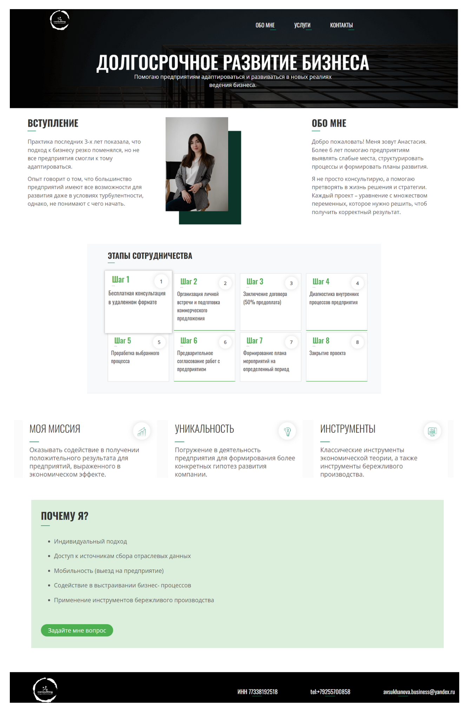

# Website for Business Consulting services 

The goal of this project was to design and develop a single-page website for a business advisor specializing in consultancy services for large companies and providing guidance on business plans, financial models, and business processes. The website has a smooth, user-friendly design and clear layout and is accessible on both mobile and desktop devices.

/ https://nastyaclifford.github.io/Website-For-Business-Consulting/ /

Design template 
https://www.figma.com/file/HjG1BAfAAaeDaaX3Kvpw2F/%D0%9C%D0%B0%D0%BA%D0%B5%D1%82-%D0%B4%D0%BB%D1%8F-%D0%90%D0%BD%D0%B0%D1%81%D1%82%D0%B0%D1%81%D0%B8%D0%B8-(FINAL)?node-id=0%3A1&t=eKznSepsQMruIlMh-0

## Project goals

- Development of a website for an individual entrepreneur, providing consulting services (business plans, financial models, business processes);
- Audience: large companies (not individuals, not sole entrepreneurs);
- The approximate structure of the website should contain the following sections:

1. Introduction
1. Self-presentation
1. Mission
1. Services provided
1. Stages of cooperation
1. Industry experience
1. Uniqueness
1. Contacts

- Website must have a responsive design and have a feedback form for interaction with users.

## Technologies & tools 

* Bootstrap 5
* HTML5 (grid, flex)
* SASS, CSS
* GitHub

## Set up instruction

git clone https://nastyaclifford.github.io/Website-For-Business-Consulting/

## Thanks to all contributors! 

